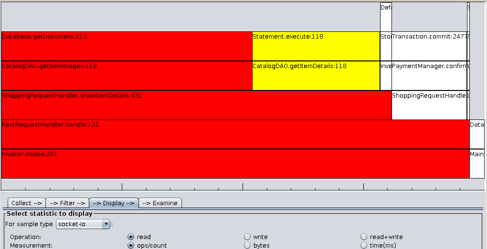
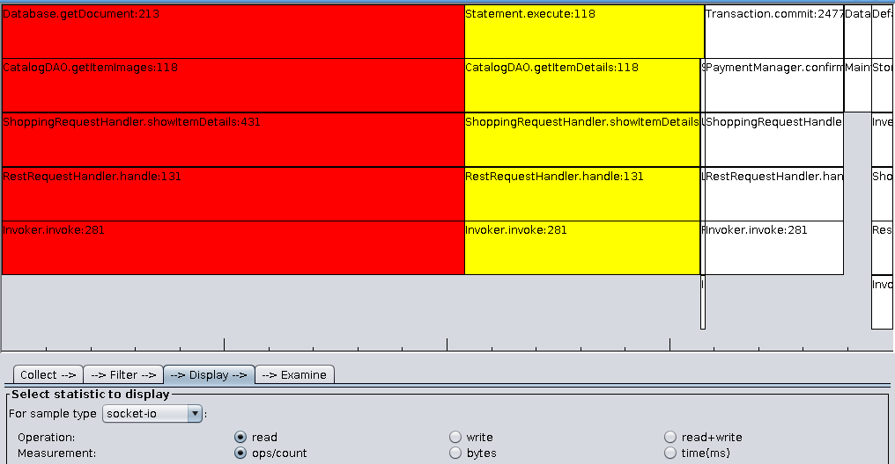

Gumshoe Load Investigator 
=========================

Overview
--------

Monitor application performance statistics associated with individual calling stacks,
interactively filter and view as a flame graph or root graph.

Gumshoe was first created initially for internal use in the Dell Cloud Manager application but
source code has since been released for public use under [these terms](LICENSE.rst).  

[Features](docs/features.md)
--------

* Analyze resource usage: measure TCP, UDP, filesystem or processor utilization
* Pinpoint lines of code: all statistics are associated with a call stack and individual stack frames
* Capture, filter and visualize as statistics are generated
* Intuitive views: flame graph and root graph
* Filter stack frames at capture and/or during visualization, modify on the fly. 

Documentation
-------------

* Short intro and demo on youtube: [latest](https://www.youtube.com/watch?v=GGJFZfwXJ44) or the original [boring version](https://www.youtube.com/watch?v=1M9GX4ENMeI).
* [Quick start guide](QUICK-START.md) walks through using with a sample application.
* Full [user guide](docs/index.md)

Flame Graph Example
-------------------

Looking at callers into an application, Invoker.invoke is responsible for >90% of the read operations
in this application.  It always calls RestRequestHandler.handle which in turn calls three different REST
operations.  One -- showItemDetails -- is responsible for >80% of read operations as it makes different calls
into the DAO layer.

Root Graph Example
------------------

Grouping now by the last frame where the application calls out to a resource,
the couchdb Database.getDocument is responsible for over half of the read operations,
while the JDBC Statement.execute about 25%, the vast majority of those from getItemDetails.

[Stack Filters](docs/filters.md)
-------------

These two examples are completely contrived, but not overly simplified.  The original call stacks in
your application are generally huge, with hundreds of frames, but gumshoe uses stack filters to find
just the relevant portions and focus the view on just those parts.
